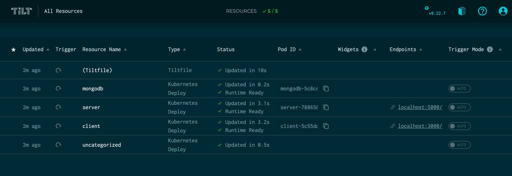

# Local Dev Example with Helm, Rancher Desktop, and Tilt

Easy local development with Kubernetes, without Docker.

This example uses the [MERN Stack Example application](https://github.com/mongodb-developer/mern-stack-example)
from MongoDB to show how to containerize and run an existing application in Tilt and Rancher Desktop.

## Setup

1. Install [Rancher Desktop](https://rancherdesktop.io).
2. Install [Tilt](https://tilt.dev).
3. Clone this repository to your machine.
4. Run `git submodule init` and `git submodule update` to clone the [mern-stack-example](https://github.com/mongodb-developer/mern-stack-example)
code into the `mern-stack-example` directory.
5. Run `tilt up`. (Note that when you quit Tilt with ctrl-C, the k8s workloads continue to run in
the background. Run `tilt down` to destroy them.)
6. Navigate to Tilt dashboard at [http://localhost:10350/](http://localhost:10350/) to watch
service startup.
7. Navigate to web interface at [http://localhost:3000/](http://localhost:3000/).

## Code Organization

* [Tiltfile](Tiltfile): Tilt configuration for local dev
* [./pipeline](./pipeline): Pipeline configuration files to support the example application
  * [./pipeline/build](./pipeline/build): Dockerfiles to build the MERN example applications
  * [./pipeline/helm-charts](./pipeline/helm-charts): Helm charts for the MERN example applications
  * [./pipeline/values](./pipeline/values): Helm value overrides files for the MongoDB Helm chart

## Implementation Notes

This example includes 3 services:

- mongodb: Loaded from Bitnami MongoDB Helm chart
- client: A React web application
- server: An Express API service

These service have been copied / adapted from
https://github.com/mongodb-developer/mern-stack-example.

The `mongodb` service is installed from the Bitnami helm chart. The MERN example applications are from
MongoDB's [MERN Stack example application](https://github.com/mongodb-developer/mern-stack-example)

Both `client` and `server` have live updates enabled. If any files in the source directory are
changed, Tilt will copy them into the running container.

## Accessing Services

Individual services are also exposed directly on different ports - see the Tilt dashboard for
links to individual services.

- http://localhost:3000/ - mapped to `client`
- http://localhost:5000/ - mapped to `server`
